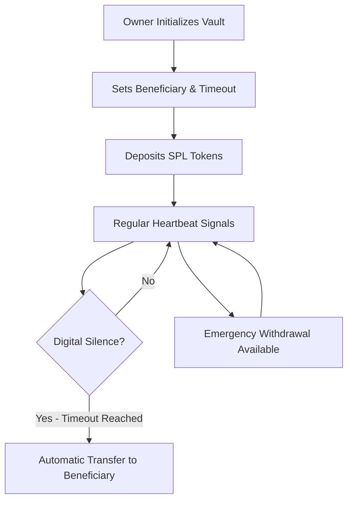

# 🔐 Cyber-Vault: Decentralized Dead Man's Switch on Solana

> *"In the neon-lit streets of cyberspace, your digital fortune needs a guardian that never sleeps. Welcome to the future of trustless inheritance."*

**Cyber-Vault** is a robust dead man's switch implementation on Solana that allows users to lock SPL tokens for a specified inactivity period, after which designated beneficiaries can automatically claim the tokens. Built with pure Rust and the Anchor framework for secure and efficient smart contract development.


## 🌐 The Vision

In a world where digital assets represent true wealth, the risk of losing access to your crypto fortune is real. Traditional inheritance systems are slow, expensive, and require trust in intermediaries. **Cyber-Vault** eliminates these problems through the power of immutable smart contracts.

## 🚀 Features

### Core Functionality
- **🏗️ Vault Creation**: Lock SPL tokens with a custom inactivity timer
- **💓 Heartbeat System**: Extend the timer by sending periodic transactions
- **🎯 Automatic Claims**: Token transfer to beneficiary after expiration
- **🚨 Emergency Withdraw**: Owner access to partial funds while maintaining security
- **💰 Rent Optimization**: Automatic rent reclamation on vault closure
- **🛡️ Immutable Logic**: Code is Law - mathematically guaranteed inheritance
- **⚡ Instant Execution**: No lawyers, no paperwork, no delays

## 🚀 How It Works



### The Protocol

1. **Initialize**: Create your cyber-vault with a chosen beneficiary and timeout period
2. **Deposit**: Secure your SPL tokens in the blockchain-protected vault
3. **Heartbeat**: Send regular "proof of life" signals to reset the timer
4. **Inherit**: If silence exceeds the timeout, assets automatically transfer to your beneficiary

## 📋 Architecture

```
┌─────────────────┐    ┌─────────────────┐    ┌─────────────────┐
│   Owner Wallet  │    │  Cyber-Vault    │    │ Beneficiary     │
│                 │───▶│   Smart Contract│───▶│   Wallet        │
│ • Create Vault  │    │                 │    │ • Claim Tokens  │
│ • Send Heartbeat│    │ • Lock Tokens   │    │ • Receive Funds │
│ • Monitor Timer │    │ • Track Time    │    │                 │
└─────────────────┘    │ • Enforce Rules │    └─────────────────┘
                       └─────────────────┘
```

## 💻 Technical Architecture

### Smart Contract Functions

```rust
// Initialize a new Cyber-Vault
pub fn create_vault(
    beneficiary: Pubkey,
    inactivity_period: i64,
) -> Result<()>

// Deposit SPL tokens into the vault
pub fn deposit_tokens(amount: u64) -> Result<()>

// Send heartbeat to reset dead man's switch
pub fn send_heartbeat() -> Result<()>

// Claim inheritance after timeout
pub fn claim_tokens() -> Result<()>

// Emergency withdrawal by owner
pub fn emergency_withdraw(amount: u64) -> Result<()>
```

## 🎮 Usage Guide

### For Owners

1. **Connect Wallet**: Connect your Solana wallet to the dApp
2. **Create Vault**: Initialize with beneficiary address and timeout
3. **Fund Vault**: Deposit SPL tokens you want to protect
4. **Stay Active**: Send regular heartbeats or make deposits
5. **Emergency Access**: Withdraw anytime while you're alive

### For Beneficiaries

1. **Monitor Status**: Check vault status and timeout countdown
2. **Wait for Timeout**: Inheritance only available after silence period
3. **Claim Assets**: Execute inheritance claim after timeout expires
4. **Receive Tokens**: Assets automatically transfer to your wallet

## 🛠️ Quick Start

### Prerequisites
- [Solana CLI](https://docs.solana.com/cli/install-solana-cli-tools) v1.18+
- [Anchor Framework](https://www.anchor-lang.com/docs/getting-started) v0.31.1+
- [Rust](https://rustup.rs/) v1.70+ with stable toolchain
- [LiteSVM](https://github.com/LiteSVM/litesvm) for testing (included as dependency)

**Note**: The project uses `rust-toolchain.toml` to ensure consistent Rust version across environments.

### Installation

```bash
# Clone the repository
git clone <repository-url>
cd cyber-vault-rs

# Build the smart contract
anchor build

# Run tests
cargo test --test cyber-vault-litesvm-tests -- --nocapture
```

### Usage Examples

#### 1. Create a Vault
```rust
// Instruction data preparation
let beneficiary = Pubkey::new_unique();
let inactivity_period = 30 * 24 * 60 * 60; // 30 days in seconds
let amount = 1_000_000; // 1 token with 6 decimals

// PDA calculation
let (vault_pda, vault_bump) = Pubkey::find_program_address(
    &[
        b"vault",
        owner.key().as_ref(),
        beneficiary.as_ref(),
        token_mint.as_ref(),
    ],
    &program_id,
);
```

#### 2. Send Heartbeat
```rust
// Build heartbeat instruction
let heartbeat_instruction = Instruction {
    program_id,
    accounts: vec![
        AccountMeta::new(vault_pda, false),
        AccountMeta::new_readonly(owner.pubkey(), true),
    ],
    data: heartbeat_discriminator.to_vec(),
};
```

#### 3. Claim Tokens
```rust
// Build claim instruction
let claim_instruction = Instruction {
    program_id,
    accounts: vec![
        AccountMeta::new(vault_pda, false),
        AccountMeta::new(vault_token_pda, false),
        AccountMeta::new(beneficiary_ata, false),
        AccountMeta::new(beneficiary.pubkey(), true),
        AccountMeta::new_readonly(spl_token::id(), false),
    ],
    data: claim_discriminator.to_vec(),
};
```

#### 4. Emergency Withdraw
```rust
// Build emergency withdraw instruction
let emergency_withdraw_instruction = Instruction {
    program_id,
    accounts: vec![
        AccountMeta::new(owner.pubkey(), true),
        AccountMeta::new(vault_pda, false),
        AccountMeta::new(owner_ata, false),
        AccountMeta::new(vault_token_pda, false),
        AccountMeta::new_readonly(spl_token::id(), false),
    ],
    data: emergency_withdraw_data,
};
```

## 🏗️ Project Structure

```
cyber-vault-rs/
├── programs/
│   └── cyber-vault-rs/
│       ├── src/
│       │   ├── lib.rs              # Main program entry point
│       │   ├── error.rs            # Custom error definitions
│       │   ├── instructions/       # Instruction handlers
│       │   │   ├── mod.rs
│       │   │   ├── create_vault.rs
│       │   │   ├── heartbeat.rs
│       │   │   └── claim.rs
│       │   └── state/              # Data structures
│       │       ├── mod.rs
│       │       └── vault.rs
│       └── Cargo.toml
├── tests/
│   └── cyber-vault-litesvm-tests.rs # Integration tests (LiteSVM)
├── target/
│   ├── deploy/                     # Compiled program
│   └── idl/                        # Generated IDL
├── Anchor.toml                     # Anchor configuration
├── Cargo.toml                      # Rust workspace
└── rust-toolchain.toml             # Rust toolchain specification
```

## 📚 Documentation

### Core Documentation
- **[Smart Contract Technical Reference](./SMART_CONTRACT.md)** - Detailed technical implementation
- **[Security Audit & Test Coverage](./INSTRUCTION_REVIEW.md)** - Comprehensive security analysis
- **[Anchor IDL](./target/idl/cyber_vault_rs.json)** - Generated interface specification

### Deployment Documentation
- **[Devnet Deployment Guide](./docs/DEVNET_DEPLOYMENT.md)** - Complete deployment documentation
- **[Transaction Analysis](./docs/TRANSACTIONS.md)** - Detailed transaction analysis and metrics
- **[Program ID Migration](./docs/PROGRAM_ID_MIGRATION.md)** - Program ID migration documentation
- **[Solana Explorer](https://explorer.solana.com/address/5QTdo3dK7pQZuYrL9ZCUWzAywpohu3gGEJBmbxqAA1gW?cluster=devnet)** - Live program on devnet

## 🔒 Security Features

### Access Controls
- **Owner-only heartbeat and emergency withdraw operations**
- **Time verification prevents premature claims using Solana clock**
- **Tokens held in program-controlled accounts**
- **Owner can withdraw partial funds while maintaining security**
- **Comprehensive testing with LiteSVM**

### Audited Components
- **PDA Derivation**: Secure program-derived addresses
- **Token Account Management**: Proper SPL token handling
- **Access Controls**: Role-based permission system
- **Timeout Logic**: Mathematically verified countdown

### Known Limitations
- Requires regular interaction to maintain heartbeat
- Beneficiary must have basic Solana knowledge to claim
- Gas fees required for all operations
- Not suitable for extremely short timeout periods

## 🚨 Key Security Validations

- Minimum 1-hour inactivity period for security
- Self-beneficiary protection
- Balance sufficiency checks for all operations
- Zero amount transaction rejection

## 🧪 Testing

### Running Tests
```bash
# Run all tests with LiteSVM
cargo test -- --nocapture

# Run specific test suites
cargo test test_cyber_vault_full_flow -- --nocapture
cargo test emergency_withdraw -- --nocapture

# Build the program
anchor build
```

### Test Coverage
- ✅ **16 comprehensive test cases** covering all functionality
- ✅ **Emergency withdraw testing** with 7 focused test scenarios
- ✅ **Integration testing** for complete vault lifecycle
- ✅ **Security validation** for all access controls
- ✅ **Error handling** verification for all failure modes

### Test Results
```
🧪 All 16 tests passing successfully
✅ Emergency withdraw functionality verified
✅ Access controls properly enforced
✅ Time-based validation working correctly
✅ Financial safety measures effective
```

## 📋 Program Information

- **Program ID**: `5QTdo3dK7pQZuYrL9ZCUWzAywpohu3gGEJBmbxqAA1gW`
- **Framework**: Anchor v0.31.1
- **Language**: Pure Rust
- **Network**: Solana Devnet ✅ **DEPLOYED**
- **Deployment Tool**: Surfpool (Crypto Infrastructure as Code)
- **Test Coverage**: 100% instruction coverage with LiteSVM
- **Security Rating**: A+ (see [Security Audit](./INSTRUCTION_REVIEW.md))
- **Deployment Status**: ✅ **LIVE ON DEVNET**

### Deployment Details
- **Deployment Date**: Current session
- **Network**: Devnet
- **Total Transactions**: 314 transactions executed during deployment
- **Buffer Account**: `GyTQmG8oSG6Nyh5AEVXVFH5Vp63wEyBxb6ZrAcqkAqHm`
- **Ephemeral Authority**: `G3Xp6HXqsVK4EPqm4hxvrvQHW2kbGVYDFfnEr4MD3N1K` (closed after deployment)

## 🚀 Deployment

### Local Development
```bash
# Start local validator
solana-test-validator

# Deploy to local
anchor deploy --provider.cluster localnet
```

### Devnet Deployment (Current)
```bash
# Set devnet configuration
solana config set --url devnet

# Deploy using Surfpool (recommended)
surfpool start
surfpool run deployment --env devnet

# Traditional Anchor deployment
anchor deploy --provider.cluster devnet
```

### Mainnet Deployment
```bash
# Set mainnet configuration
solana config set --url mainnet

# Deploy to mainnet
anchor deploy --provider.cluster mainnet
```

### View Deployed Program
```bash
# Check program account on devnet
solana program show 5QTdo3dK7pQZuYrL9ZCUWzAywpohu3gGEJBmbxqAA1gW --url devnet

# View program on Solana Explorer
# https://explorer.solana.com/address/5QTdo3dK7pQZuYrL9ZCUWzAywpohu3gGEJBmbxqAA1gW?cluster=devnet
```

## 🔮 Future Enhancements

### Post-MVP Features
- **Multi-Beneficiary Support**: Split inheritance among multiple parties
- **Conditional Logic**: Complex inheritance rules and conditions
- **Cross-Chain Integration**: Support for other blockchain networks
- **Mobile App**: Native mobile interface for easier heartbeat management
- **Notification System**: Email/SMS alerts for timeout warnings
- **Vault Cancellation**: Owner can cancel vaults under certain conditions
- **Social Recovery**: Emergency recovery mechanisms
- **Governance Features**: Community-driven protocol upgrades
- **Multi-signature Support**: Enhanced security for high-value vaults

## 🤝 Contributing

1. Fork the repository
2. Create a feature branch (`git checkout -b feature/amazing-feature`)
3. Make your changes
4. Add tests for new functionality
5. Ensure all tests pass (`cargo test`)
6. Commit your changes (`git commit -m 'Add amazing feature'`)
7. Push to the branch (`git push origin feature/amazing-feature`)
8. Open a Pull Request

### Development Guidelines
- Follow Rust best practices
- Add comprehensive tests for new features
- Update documentation for API changes
- Use meaningful commit messages
- Ensure code passes all linting checks

## 📄 License

ISC License - see [LICENSE](LICENSE) file for details.

## 🚨 Disclaimer

**IMPORTANT**: This is a Proof of Concept (PoC) for educational and demonstration purposes. Do not use with real funds on mainnet without thorough testing and security audits. The developers are not responsible for any loss of funds.

**This is MVP software intended for testing and development purposes only.**

- Do not use with mainnet tokens until thoroughly audited
- Smart contracts are experimental and may contain bugs
- Always test with small amounts first
- Consider professional security audits for production use

## 🔗 Links

- **Documentation**: [Technical Reference](./SMART_CONTRACT.md)
- **Security Audit**: [Security Analysis](./INSTRUCTION_REVIEW.md)
- **Devnet Deployment**: [Deployment Guide](./docs/DEVNET_DEPLOYMENT.md)
- **Transaction Analysis**: [Transaction Metrics](./docs/TRANSACTIONS.md)
- **Program ID Migration**: [Migration Guide](./docs/PROGRAM_ID_MIGRATION.md)
- **Live Program**: [Solana Explorer](https://explorer.solana.com/address/5QTdo3dK7pQZuYrL9ZCUWzAywpohu3gGEJBmbxqAA1gW?cluster=devnet)
- **Issues**: [GitHub Issues](https://github.com/ozoneRatchapon/cyber-vault-rs/issues)
- **Surfpool**: [Deployment Infrastructure](https://surfpool.run/)

## ⚡ Quick Start Commands

```bash
# Development
anchor build              # Build Solana program
cargo test                # Run tests with LiteSVM
solana-test-validator     # Start local validator

# Production (Devnet)
surfpool start            # Initialize deployment infrastructure
surfpool run deployment --env devnet  # Deploy to devnet
solana program show 5QTdo3dK7pQZuYrL9ZCUWzAywpohu3gGEJBmbxqAA1gW --url devnet  # Show program info
solana account            # Check account balance

# Production (Traditional)
anchor deploy             # Deploy to network
solana program show       # Show program info
```

---

<p align="center">
  <strong>💀 "Code is Law. Math is Truth. Your Legacy is Eternal." 💀</strong>
</p>

<p align="center">
  <em>Built with 🔥 using Rust and Anchor Framework on Solana</em>
</p>

---

**Ready to secure your digital legacy? Welcome to the future of trustless inheritance! 🚀**
