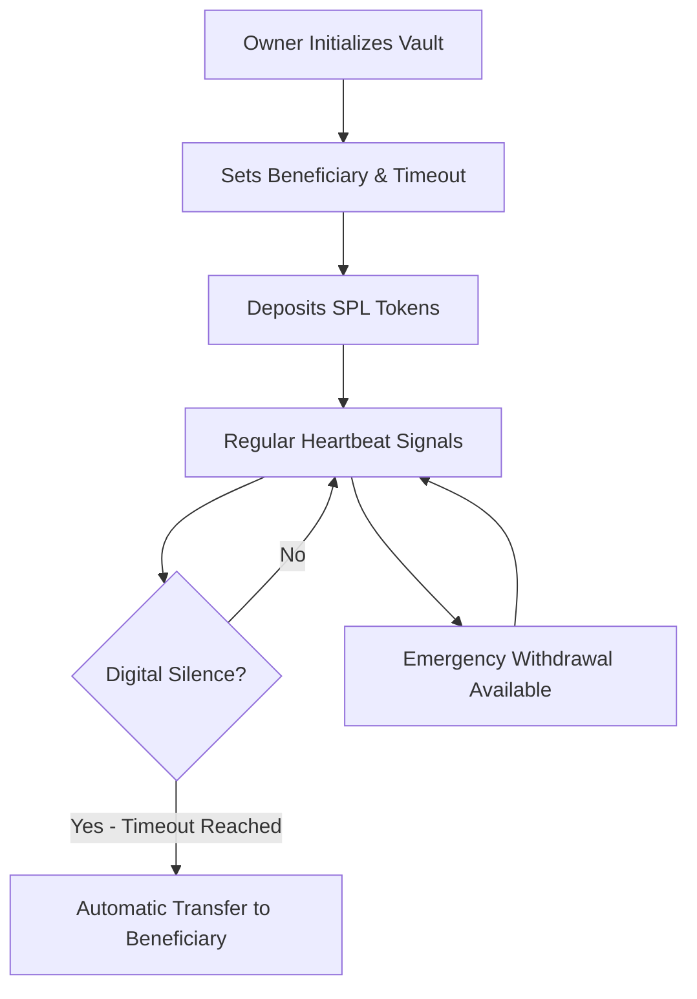

# 🔐 Cyber-Vault: Decentralized Dead Man's Switch

> *"In the neon-lit streets of cyberspace, your digital fortune needs a guardian that never sleeps. Welcome to the future of trustless inheritance."*

**Cyber-Vault** is a next-generation digital asset security solution built on Solana, embodying the core tenet of self-sovereignty in the cyberpunk future. This Proof of Concept (PoC) implements a fully decentralized "Dead Man's Switch" mechanism that ensures your digital legacy lives on, even when you don't.


## 🌐 The Vision

In a world where digital assets represent true wealth, the risk of losing access to your crypto fortune is real. Traditional inheritance systems are slow, expensive, and require trust in intermediaries. **Cyber-Vault** eliminates these problems through the power of immutable smart contracts.

### Key Features

- **🔒 Decentralized Dead Man's Switch**: Automatic asset transfer after digital silence
- **💎 Multi-Token Support**: Secure any SPL token in your cyber-vault
- **💓 Heartbeat Protocol**: Proof-of-life mechanism to maintain control
- **⚡ Instant Execution**: No lawyers, no paperwork, no delays
- **🛡️ Immutable Logic**: Code is Law - mathematically guaranteed inheritance
- **🚨 Emergency Controls**: Owner can withdraw assets at any time

## 🚀 How It Works


```mermaid
graph TD
    A[Owner Initializes Vault] --> B[Sets Beneficiary & Timeout]
    B --> C[Deposits SPL Tokens]
    C --> D[Regular Heartbeat Signals]
    D --> E{Digital Silence?}
    E -->|No| D
    E -->|Yes - Timeout Reached| F[Automatic Transfer to Beneficiary]
    D --> G[Emergency Withdrawal Available]
    G --> D
```

### The Protocol

1. **Initialize**: Create your cyber-vault with a chosen beneficiary and timeout period
2. **Deposit**: Secure your SPL tokens in the blockchain-protected vault
3. **Heartbeat**: Send regular "proof of life" signals to reset the timer
4. **Inherit**: If silence exceeds the timeout, assets automatically transfer to your beneficiary

## 💻 Technical Architecture

### Smart Contract Functions

```rust
// Initialize a new Cyber-Vault
pub fn initialize_vault(
    beneficiary: Pubkey,
    timeout_seconds: i64,
) -> Result<()>

// Deposit SPL tokens into the vault
pub fn deposit_tokens(amount: u64) -> Result<()>

// Send heartbeat to reset dead man's switch
pub fn send_heartbeat() -> Result<()>

// Claim inheritance after timeout
pub fn claim_inheritance() -> Result<()>

// Emergency withdrawal by owner
pub fn emergency_withdraw(amount: u64) -> Result<()>
```

### Security Features

- **Minimum Timeout**: 1 hour minimum to prevent accidental triggers
- **Self-Beneficiary Protection**: Cannot set yourself as beneficiary
- **Access Controls**: Only authorized parties can interact with vault functions
- **Atomic Operations**: All transfers are atomic and reversible only by the owner

## 🛠️ Development Setup

### Prerequisites

- Node.js 18+
- Rust 1.70+
- Solana CLI 1.18+
- Anchor Framework 0.30+

### Installation

```bash
# Clone the repository
git clone https://github.com/your-org/cyber-vault.git
cd cyber-vault

# Install dependencies
npm install

# Build the Anchor program
npm run anchor-build

# Generate client code
npm run codama:js

# Run tests
npm run anchor-test

# Start local development
npm run dev
```

### Project Structure

```
cyber-vault/
├── anchor/                 # Solana program (Rust)
│   ├── programs/
│   │   └── cybervault/
│   │       └── src/
│   │           └── lib.rs  # Main program logic
│   ├── tests/              # Program tests
│   └── target/             # Build artifacts
├── src/                    # React frontend
├── public/                 # Static assets
└── package.json            # Project dependencies
```

## 🎮 Usage Guide

### For Owners

1. **Connect Wallet**: Connect your Solana wallet to the dApp
2. **Create Vault**: Initialize with beneficiary address and timeout
3. **Fund Vault**: Deposit SPL tokens you want to protect
4. **Stay Active**: Send regular heartbeats or make deposits
5. **Emergency Access**: Withdraw anytime while you're alive

### For Beneficiaries

1. **Monitor Status**: Check vault status and timeout countdown
2. **Wait for Timeout**: Inheritance only available after silence period
3. **Claim Assets**: Execute inheritance claim after timeout expires
4. **Receive Tokens**: Assets automatically transfer to your wallet

## 🧪 Testing

The project includes comprehensive tests covering:

- Vault initialization and configuration
- Token deposit and withdrawal operations
- Heartbeat mechanism and timeout logic
- Inheritance claiming process
- Security constraints and edge cases

```bash
# Run the test suite
npm run anchor-test

# Run specific test categories
npm run test -- --grep "Initialization"
npm run test -- --grep "Inheritance"
```

## 🔐 Security Considerations

### Audited Components
- **PDA Derivation**: Secure program-derived addresses
- **Token Account Management**: Proper SPL token handling
- **Access Controls**: Role-based permission system
- **Timeout Logic**: Mathematically verified countdown

### Known Limitations
- Requires regular interaction to maintain heartbeat
- Beneficiary must have basic Solana knowledge to claim
- Gas fees required for all operations
- Not suitable for extremely short timeout periods

## 🌟 Future Enhancements

- **Multi-Beneficiary Support**: Split inheritance among multiple parties
- **Conditional Logic**: Complex inheritance rules and conditions
- **Cross-Chain Integration**: Support for other blockchain networks
- **Mobile App**: Native mobile interface for easier heartbeat management
- **Notification System**: Email/SMS alerts for timeout warnings

## 🤝 Contributing

We welcome contributions from the cyberpunk community! Please see our [Contributing Guidelines](CONTRIBUTING.md) for details.

### Development Workflow

1. Fork the repository
2. Create a feature branch
3. Implement your changes with tests
4. Submit a pull request

## 📄 License

This project is licensed under the MIT License - see the [LICENSE](LICENSE) file for details.

## 🚨 Disclaimer

**IMPORTANT**: This is a Proof of Concept (PoC) for educational and demonstration purposes. Do not use with real funds on mainnet without thorough testing and security audits. The developers are not responsible for any loss of funds.

## 🔗 Links

- **Demo**: [https://cyber-vault.demo](https://cyber-vault.demo)
- **Documentation**: [https://docs.cyber-vault.xyz](https://docs.cyber-vault.xyz)
- **Twitter**: [@CyberVaultDAO](https://twitter.com/CyberVaultDAO)
- **Discord**: [Join Community](https://discord.gg/cybervault)

---

<p align="center">
  <strong>💀 "Code is Law. Math is Truth. Your Legacy is Eternal." 💀</strong>
</p>

<p align="center">
  <em>Built with 🔥 for the decentralized future</em>
</p>

---

## ⚡ Quick Start Commands

```bash
# Development
npm run dev              # Start development server
npm run anchor-build     # Build Solana program
npm run anchor-test      # Run tests

# Production
npm run build           # Build for production
npm run preview         # Preview production build

# Solana Operations
solana program deploy   # Deploy to network
solana program show     # Show program info
solana account          # Check account balance
```

**Ready to secure your digital legacy? Welcome to the future of trustless inheritance! 🚀**